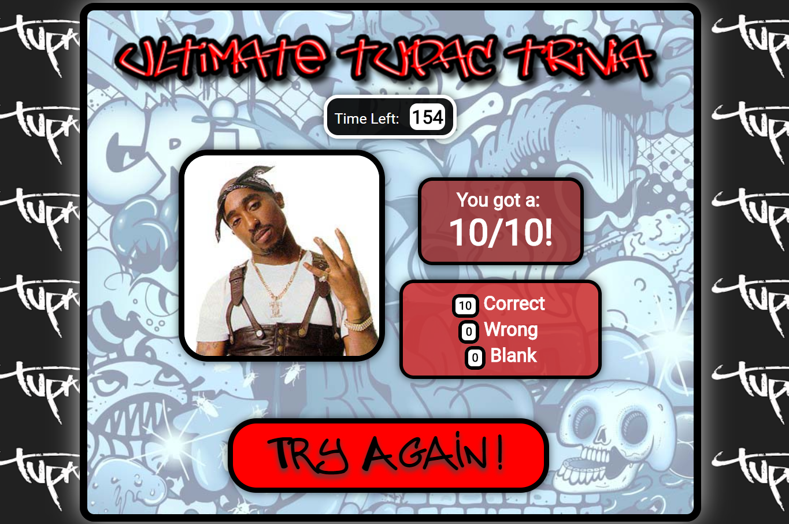

# JavaScript/jQuery Timed "Tupac Trivia" Quiz

 [View Live!](https://bereznd1.github.io/Tupac-Trivia-Quiz/) 

## Brief Description

The **JavaScript/jQuery Timed "Tupac Trivia" Quiz** provides users with multiple choice questions regarding the life & career of Hip-Hop legend Tupac Shakur. When a user answers all of the questions & submits the quiz, or when time runs out, the page dynamically wipes away all the question content and shows a results display instead, which tells users how many questions they got correct, how many they got wrong, and how many they left blank, as well as providing them with a button that they can click to take the quiz again.

## How This Was Achieved

I set up global variables to hold the html content for each question & its corresponding answer options, as well as global variables to track correct answers, wrong answers, and unanswered questions. When a user clicks the Start button that is shown on-screen when the page first loads, this activates the *Start* function. A **setTimeout** function is set up so that after 3 minutes, the game times out and the user's answers are submitted. A **setInterval** function is also set up so that with every second that goes by, the amount of seconds left to complete the quiz is dynamically updated onscreen. 

The *Start* function then proceeds to dynamically populate the main div on the page, using jQuery, with the question & answer content and the div containing the seconds countdown, as well as the submit button. As mentioned earlier, when a user clicks the submit button or when 3 minutes passes by and the game times out by itself, the *submit* function is activated. This function clears out the timer & the on-screen seconds countdown and then creates variables for each question that evaluate to true if the correct option for that question has been filled out by the user. Next, the function uses an **If-Else** statement for each question to check if an answer was selected for that question. IF an answer WAS selected and that answer is correct, the function adds a point to the *Correct* variable. IF an answer WAS selected and that answer is incorrect, the function adds a point to the *Wrong* variable. If no answer was selected at all, the function adds a point to the *Unanswered* variable.

Once each question has been checked in this manner, the function first empties out the main div from its previous content, and then it uses jQuery in order to manipulate the DOM into showing the amount of seconds left on the clock when the quiz was submitted, a picture of Tupac, and 2 separate results divs. One of these divs shows how many answers the user got correct out of 10, while the other one shows exactly how many answers were correct, how many were wrong, and how many were left blank. Finally, a *Try Again* button is displayed at the bottom of the page, which calls the *Start* function and displays the trivia questions on screen once again, allowing the user to play another time.
